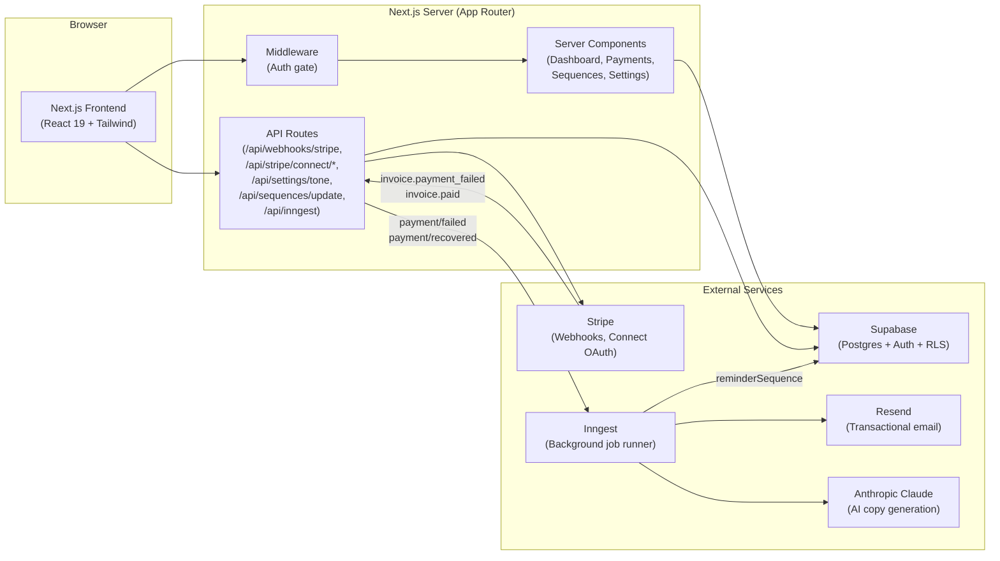
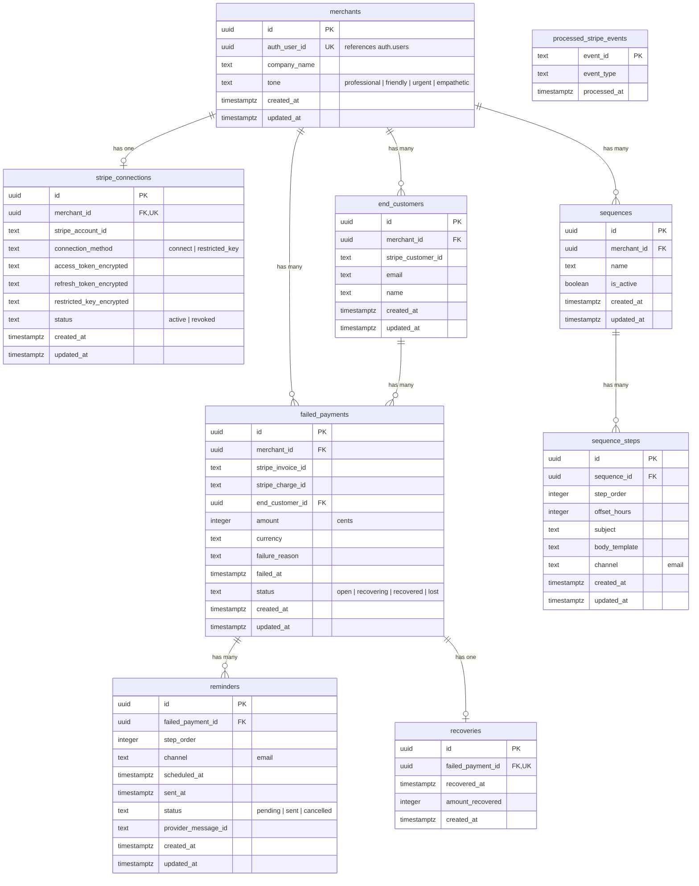

# Recover -- Architecture Document

## 1. System Overview

Recover is a dunning and failed-payment recovery platform for SaaS merchants. When a subscriber's payment fails on Stripe, Recover detects the failure via webhook, enqueues a multi-step reminder sequence, generates personalized email copy with AI, and sends the reminders on a configurable cadence. When the subscriber updates their payment method and the invoice is paid, Recover cancels remaining reminders and records the recovery.

### Tech Stack

| Layer | Technology | Version |
|---|---|---|
| Framework | Next.js (App Router) | 16.2.x |
| UI | React + Tailwind CSS | React 19, Tailwind 4 |
| Database & Auth | Supabase (Postgres + Auth + RLS) | supabase-js 2.x |
| Payments | Stripe (Connect OAuth + Restricted Keys) | stripe 22.x |
| Background Jobs | Inngest | 4.x |
| Transactional Email | Resend | 6.x |
| AI Copy Generation | Anthropic Claude (claude-sonnet-4-20250514) | SDK 0.106.x |
| Language | TypeScript | 5.x |

### How the Components Connect



---

## 2. Service Architecture

### Supabase (Database + Auth)

- **Role**: Primary data store and authentication provider.
- **Auth**: Email/password authentication via Supabase Auth. The PKCE flow exchanges an authorization code for a session in `/auth/callback`. On first login, a `merchants` row and a default 4-step recovery sequence are automatically provisioned using the service-role client.
- **Database**: Postgres with Row-Level Security (RLS) enabled on all tenant tables. The anon key is used in browser and session-scoped server clients; the service-role key is used in webhooks and Inngest functions that operate outside a user session.
- **Two client patterns**:
  - `createClient()` -- session-scoped, respects RLS via the authenticated user's JWT.
  - `createServiceClient()` -- service-role, bypasses RLS for webhook and background-job processing.

### Stripe (Payments)

- **Role**: Source of payment failure and recovery events.
- **Connection methods**:
  1. **Stripe Connect OAuth** -- `/api/stripe/connect/start` initiates the OAuth flow; `/api/stripe/connect/callback` exchanges the code for tokens. CSRF protection via a nonce stored in an `httpOnly` cookie and embedded in the `state` parameter.
  2. **Restricted API Key** -- `/api/stripe/connect/restricted-key` accepts a key, validates it against `stripe.balance.retrieve()`, encrypts it with AES-256-GCM, and stores the ciphertext.
- **Webhook endpoint**: `POST /api/webhooks/stripe` verifies the Stripe signature, performs an idempotency check against `processed_stripe_events`, then routes `invoice.payment_failed` and `invoice.paid` events. Failed payments are recorded and trigger an Inngest event; successful payments mark the failure as recovered and cancel pending reminders.

### Inngest (Background Jobs)

- **Role**: Durable, event-driven workflow execution.
- **Serve endpoint**: `GET|POST|PUT /api/inngest` registers functions with the Inngest dev server / cloud.
- **`reminderSequence` function**: Triggered by `payment/failed`. Loads the merchant's active sequence steps, then iterates through each step with `step.sleep()` delays (based on `offset_hours`). At each step it checks whether the payment is still open, generates AI copy (with template fallback), sends the email via Resend, and records a `reminders` row. The entire function is cancelled if a `payment/recovered` event arrives with a matching `failed_payment_id`.

### Resend (Email)

- **Role**: Transactional email delivery.
- **Usage**: Sends branded HTML emails from `{companyName} <recover@updates.recover-app.com>`. Returns a `message_id` that is stored in the `reminders.provider_message_id` column.

### Anthropic Claude (AI)

- **Role**: Generates personalized reminder email subject lines and body copy.
- **Model**: `claude-sonnet-4-20250514`.
- **Prompt design**: The prompt includes the customer name, amount, company name, a tone directive (professional/friendly/urgent/empathetic), and an escalation signal based on the step number. The AI returns JSON with `subject` and `body` fields. If the AI call fails, the system falls back to Mustache-style templates stored in `sequence_steps.body_template`.

---

## 3. Directory Structure

```
src/
  app/
    layout.tsx                          # Root layout (HTML shell, fonts, global CSS)
    page.tsx                            # Landing page (public)
    landing-interactive.tsx             # Interactive landing page component
    login/page.tsx                      # Login page
    signup/page.tsx                     # Signup page
    auth/callback/route.ts             # Supabase PKCE callback + merchant provisioning
    dashboard/
      layout.tsx                        # Authenticated layout with sidebar nav
      page.tsx                          # Dashboard overview (metrics, recent failures)
      sign-out-button.tsx               # Client component for sign-out
      status-badge.tsx                  # Shared status badge component
      payments/
        page.tsx                        # Failed payments list with status filter
        payments-filter.tsx             # Client component for status filter tabs
      sequences/
        page.tsx                        # Sequence editor page
        sequence-editor.tsx             # Client component for editing steps
      settings/
        page.tsx                        # Settings page (Stripe connection, tone)
        connect-button.tsx              # Stripe Connect OAuth button
        restricted-key-form.tsx         # Restricted API key input form
        tone-selector.tsx               # AI tone preference selector
    api/
      inngest/route.ts                  # Inngest serve endpoint
      webhooks/stripe/route.ts          # Stripe webhook handler
      stripe/connect/
        start/route.ts                  # Initiate Stripe Connect OAuth
        callback/route.ts              # Handle OAuth callback
        restricted-key/route.ts        # Save restricted API key
      settings/tone/route.ts           # Update merchant tone preference
      sequences/update/route.ts        # Update sequence step templates
  lib/
    supabase/
      client.ts                         # Browser Supabase client (anon key)
      server.ts                         # Server Supabase client + service-role client
    stripe/
      client.ts                         # Stripe SDK singleton
    inngest/
      client.ts                         # Inngest client (app id: "recover")
      functions.ts                      # reminderSequence function definition
    resend/
      client.ts                         # Resend SDK singleton
    anthropic/
      client.ts                         # Anthropic SDK singleton
      generate-copy.ts                  # AI reminder copy generation
    crypto/
      encrypt.ts                        # AES-256-GCM encrypt/decrypt utilities
    format.ts                           # Currency formatting (cents to display)
  types/
    database.ts                         # TypeScript interfaces for all 8 entity types
  middleware.ts                         # Auth middleware (redirect unauthenticated users)
supabase/
  migrations/
    00001_initial_schema.sql            # Tables, RLS policies, pgcrypto extension
    00002_add_unique_constraints.sql    # Unique constraints for upserts
    00003_add_tone_indexes_constraints.sql  # Tone column, indexes, dedup constraints
```

---

## 4. Database Schema

The database consists of 9 tables. All tenant-scoped tables have RLS enabled and enforce `merchant_id` isolation.

### Entity-Relationship Diagram



### Table Details

| Table | Purpose | Key Constraints |
|---|---|---|
| `merchants` | One row per SaaS merchant using Recover. Links to `auth.users`. | `auth_user_id` unique; RLS: own row only |
| `stripe_connections` | Stores the merchant's Stripe integration (OAuth or restricted key). | One per merchant (unique `merchant_id`); index on `stripe_account_id` for webhook resolution |
| `end_customers` | The merchant's subscribers whose payments have failed. | Unique on `(merchant_id, stripe_customer_id)` for upsert |
| `failed_payments` | Each failed invoice or charge detected via webhook. | Unique on `(merchant_id, stripe_invoice_id)`; index on `(merchant_id, status)` for dashboard queries |
| `sequences` | Named reminder cadence templates. One active sequence per merchant. | Cascades from `merchants` |
| `sequence_steps` | Individual steps within a sequence, with timing and templates. | Unique on `(sequence_id, step_order)` |
| `reminders` | Tracks each individual email send attempt. | Unique on `(failed_payment_id, step_order)` to prevent duplicates |
| `recoveries` | Records a successful recovery with the amount collected. | One-to-one with `failed_payments` (unique `failed_payment_id`) |
| `processed_stripe_events` | Idempotency table to prevent re-processing webhook events. | Primary key on `event_id`; no RLS (service-role only) |

---

## 5. Authentication & Authorization

### Supabase Auth Flow

1. **Signup/Login**: The user submits credentials on `/signup` or `/login`. Supabase Auth handles email/password authentication.
2. **PKCE Callback**: After authentication, Supabase redirects to `/auth/callback` with an authorization `code`. The route calls `supabase.auth.exchangeCodeForSession(code)` to establish the session.
3. **Merchant Provisioning**: On the first successful login, the callback uses the service-role client to insert a `merchants` row, a default `sequences` row, and four `sequence_steps` rows. This runs outside RLS because the newly created merchant row does not yet exist for the session user to "own."

### Middleware

The middleware (`src/middleware.ts`) runs on every request except static assets:

- Creates a Supabase server client that reads and refreshes the session cookie.
- **Auth callback and API routes** are passed through without auth checks (webhooks and Inngest need unauthenticated access).
- **Unauthenticated users** accessing protected routes are redirected to `/login`.
- **Authenticated users** visiting `/login` or `/signup` are redirected to `/dashboard`.

### Two Supabase Clients

| Client | Created By | Auth Context | RLS Behavior |
|---|---|---|---|
| Session client (`createClient`) | `@supabase/ssr` with cookie-based auth | Carries the user's JWT | Queries filtered by RLS policies (user sees only their own data) |
| Service client (`createServiceClient`) | `@supabase/supabase-js` with service-role key | No user context | Bypasses RLS entirely; used by webhooks, Inngest, and provisioning |

### RLS Enforcement

Every tenant table has a single RLS policy that gates all operations (`for all using (...)`). The policy checks that the row's `merchant_id` traces back to a `merchants` row where `auth_user_id = auth.uid()`. This means:

- Dashboard pages and mutation API routes use the session client. RLS automatically scopes all reads and writes to the authenticated merchant.
- The webhook handler, Inngest functions, and provisioning logic use the service-role client to operate across tenants.

---

## 6. Security Measures

### AES-256-GCM Encryption

Stripe API keys and OAuth tokens are encrypted at rest before being stored in the database (`src/lib/crypto/encrypt.ts`):

- **Algorithm**: AES-256-GCM (authenticated encryption).
- **Key**: 32-byte key loaded from the `ENCRYPTION_KEY` environment variable (64 hex characters). Validated on every encrypt/decrypt call.
- **IV**: 12-byte random initialization vector generated per encryption operation.
- **Storage format**: `iv:authTag:ciphertext` (all hex-encoded), stored in `stripe_connections.restricted_key_encrypted`, `access_token_encrypted`, or `refresh_token_encrypted`.

### CSRF Protection (Stripe Connect OAuth)

The Stripe Connect OAuth flow uses a two-layer CSRF defense:

1. A cryptographic nonce (`randomUUID()`) is embedded in the base64url-encoded `state` parameter.
2. The same nonce is stored in an `httpOnly`, `secure`, `sameSite: lax` cookie scoped to the callback path with a 10-minute TTL.
3. On callback, the nonce from the `state` parameter is compared to the cookie value. A mismatch aborts the flow.
4. The `state` also contains the `user_id`, which is compared to the authenticated session to prevent cross-user attacks.

### HTML Escaping

The `escapeHtml()` function in `src/lib/inngest/functions.ts` escapes `&`, `<`, `>`, and `"` in merchant names and email body text before embedding them in the HTML email template. This prevents XSS if a merchant name contains HTML characters.

### Input Validation

- **Tone setting**: Server-side allowlist check against `["professional", "friendly", "urgent", "empathetic"]`.
- **Sequence steps**: `offset_hours` is clamped to non-negative integers with `Math.max(0, Math.floor(...))`.
- **Restricted key**: Validated by calling `stripe.balance.retrieve()` before storing. Invalid keys are rejected with a 400 response.
- **Webhook signature**: Every Stripe webhook is verified with `Stripe.webhooks.constructEvent()` using the `STRIPE_WEBHOOK_SECRET`.
- **JSON parsing**: All API routes wrap `request.json()` in try/catch and return 400 on invalid input.

### Webhook Idempotency

The `processed_stripe_events` table prevents duplicate processing:

1. Before handling an event, the handler checks if `event_id` already exists.
2. The event is inserted before processing (at-most-once semantics).
3. A unique constraint violation (error code `23505`) from concurrent duplicates is treated as a no-op.

### Security Headers and Cookie Configuration

- OAuth nonce cookie: `httpOnly: true`, `secure: true`, `sameSite: "lax"`, `maxAge: 600` (10 minutes), path-scoped to callback endpoint.
- Supabase session cookies are managed by `@supabase/ssr` with secure defaults.

---

## 7. Multi-Tenancy Model

### Merchant-ID Scoping

Every piece of business data in Recover belongs to exactly one merchant. The `merchant_id` column is the universal tenant discriminator:

- `stripe_connections.merchant_id`
- `end_customers.merchant_id`
- `failed_payments.merchant_id`
- `sequences.merchant_id`

Child tables (`sequence_steps`, `reminders`, `recoveries`) are scoped transitively through their parent's foreign key chain.

### RLS Policy Pattern

All RLS policies follow the same pattern -- they check that the row's ownership chain resolves to the authenticated user:

```sql
-- Direct child of merchants:
for all using (merchant_id in (
  select id from merchants where auth_user_id = auth.uid()
));

-- Grandchild (e.g., sequence_steps through sequences):
for all using (sequence_id in (
  select s.id from sequences s
  join merchants m on s.merchant_id = m.id
  where m.auth_user_id = auth.uid()
));
```

This means merchant A cannot read, update, or delete merchant B's data through any query, even if they know the row's UUID. The policy runs inside Postgres itself, so even a bug in application code cannot bypass it (as long as the session client is used).

### Data Isolation Guarantees

| Guarantee | Mechanism |
|---|---|
| Merchant A cannot see merchant B's data | RLS policies on every tenant table |
| Webhook events are attributed to the correct merchant | `resolveMerchant()` looks up `stripe_connections.stripe_account_id` |
| Background jobs operate on the correct merchant | Inngest events carry `merchant_id`; the service client reads only the specified merchant's data |
| New merchants start with isolated default data | Provisioning in `/auth/callback` creates merchant-scoped sequences and steps |
| One Stripe connection per merchant | Unique constraint on `stripe_connections.merchant_id` |
| One customer identity per merchant-Stripe pair | Unique constraint on `end_customers(merchant_id, stripe_customer_id)` |

### Exception: `processed_stripe_events`

This table has no RLS and no `merchant_id` column. It is a global idempotency log accessed only by the webhook handler using the service-role client. It stores only the Stripe event ID and type -- no tenant-specific business data.
