# Recover -- Flow Diagrams

This document describes the core flows of the Recover dunning/failed-payment recovery platform using Mermaid diagrams. Each section covers a distinct subsystem.

---

## 1. User Authentication Flow

A new merchant signs up with email, password, and optional company name. Supabase sends a confirmation email. When the user clicks the confirmation link, the auth callback provisions a merchant record, a default recovery sequence (4 steps), and redirects to the dashboard.

Returning users sign in with email/password and are routed directly to the dashboard.

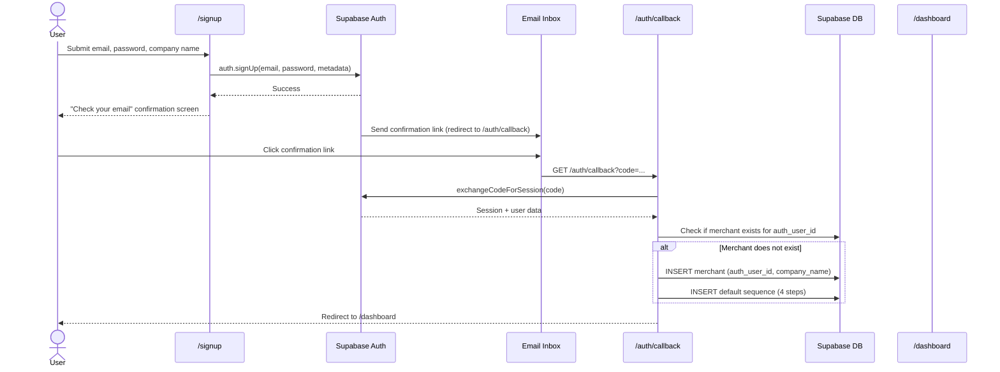

### Middleware Route Protection

The Next.js middleware checks every request for authentication status and enforces route access rules.

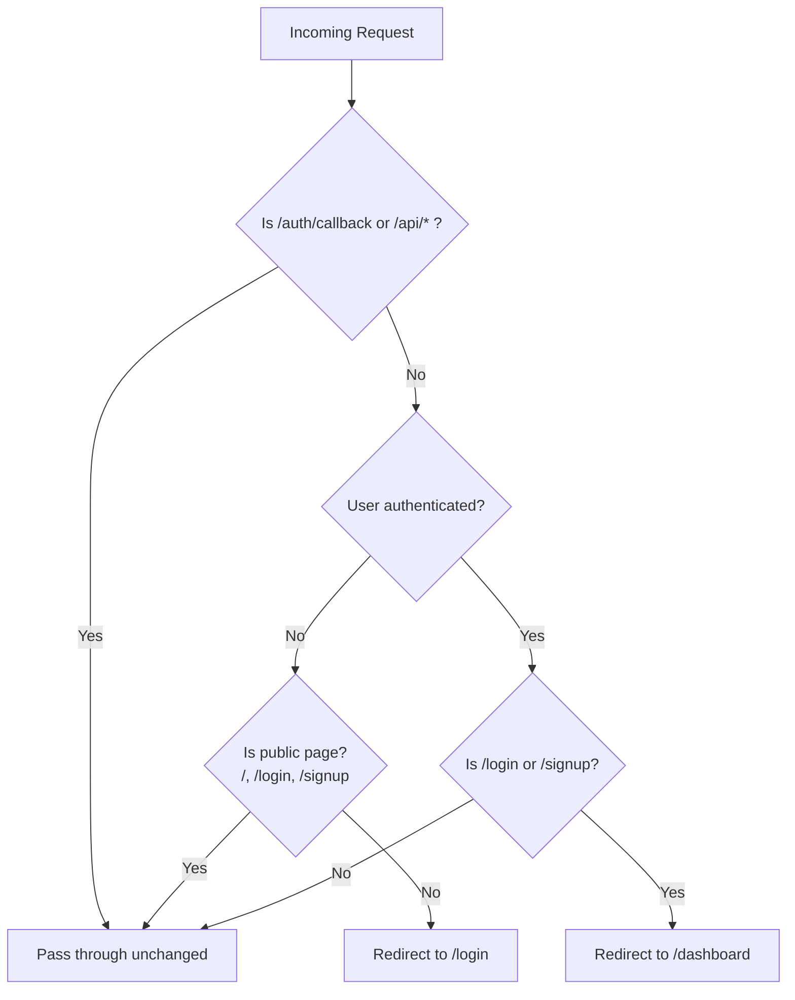

---

## 2. Stripe Connect OAuth Flow

Merchants connect their Stripe account via OAuth. The flow uses a nonce stored in a secure cookie to prevent CSRF. On success, a `stripe_connections` record is upserted with `connection_method: "connect"`.

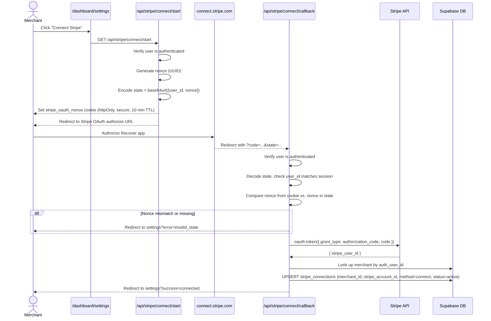

---

## 3. Restricted Key Setup Flow

As an alternative to OAuth, merchants can paste a Stripe restricted API key. The key is validated by calling the Stripe Balance API, then AES-encrypted before storage.

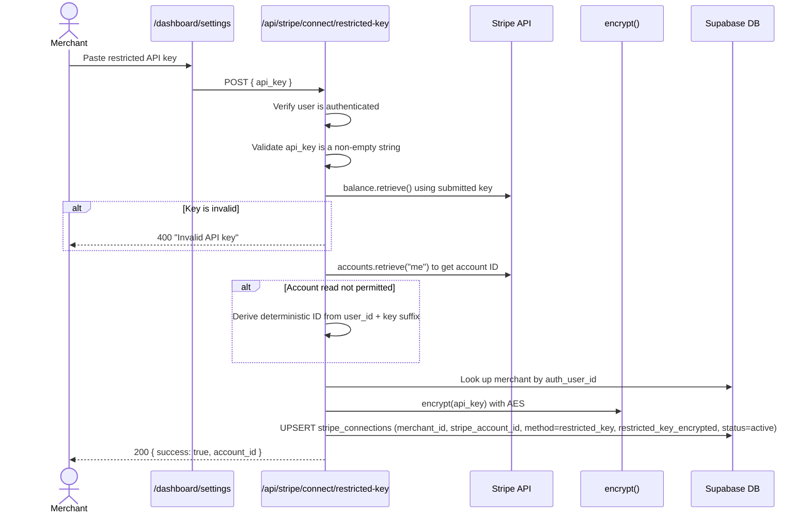

---

## 4. Webhook Processing Flow

Stripe sends webhook events to `/api/webhooks/stripe`. The handler verifies the signature, deduplicates via the `processed_stripe_events` table, resolves the merchant, and routes to type-specific handlers. Failed payments trigger Inngest recovery sequences; successful payments mark prior failures as recovered.

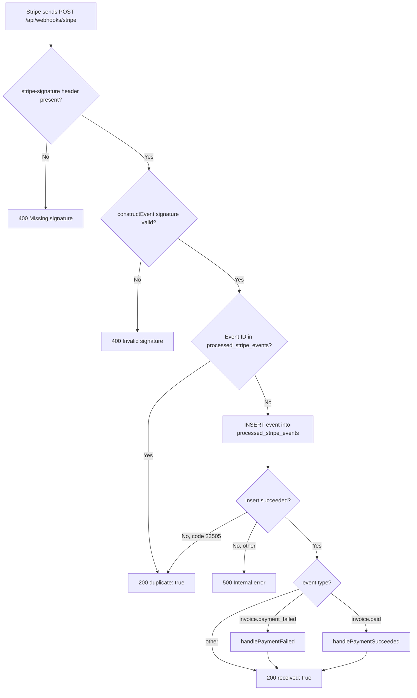

### handlePaymentFailed Detail

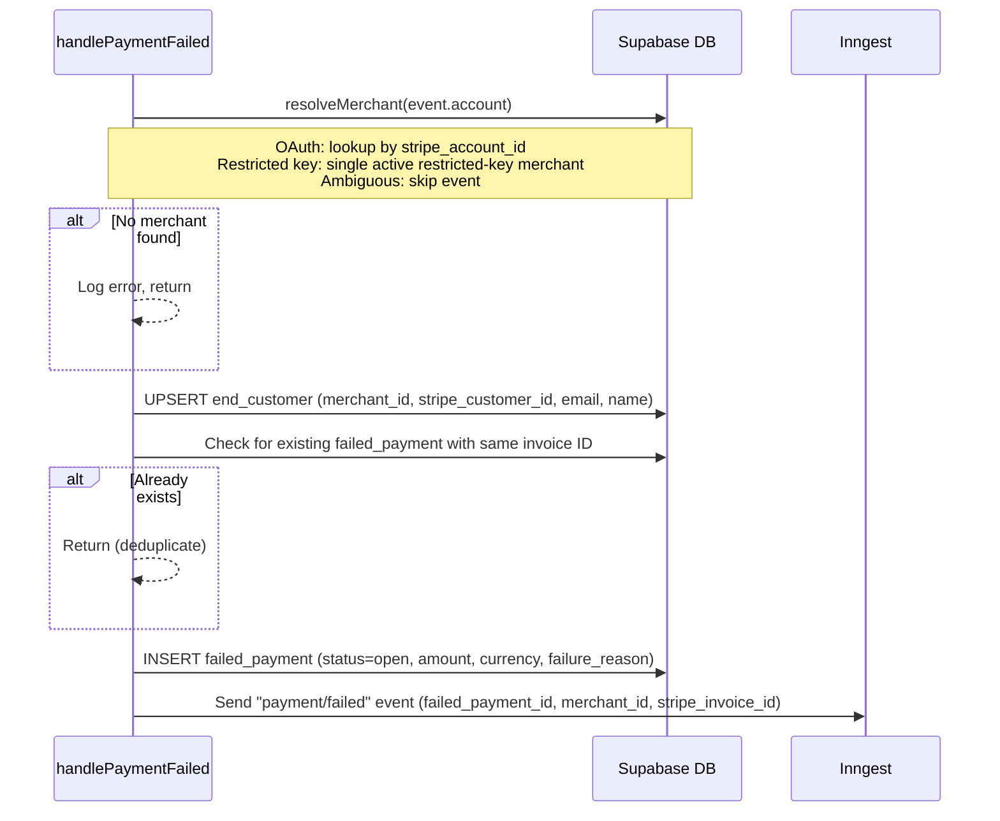

### handlePaymentSucceeded Detail

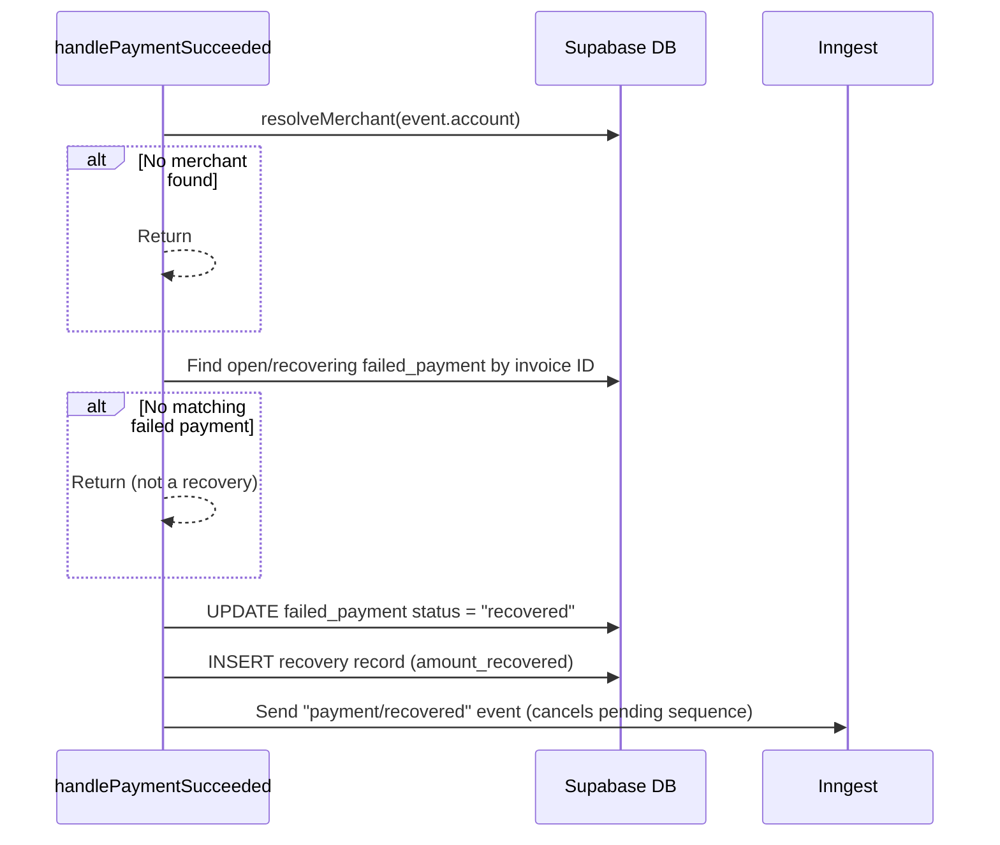

---

## 5. Recovery Sequence Flow

When a `payment/failed` Inngest event fires, the `reminder-sequence` function executes the merchant's active recovery sequence step by step. Each step waits its configured delay, checks if the payment is still outstanding, generates email copy (AI with template fallback), and sends via Resend.

The entire function is cancelled automatically if a `payment/recovered` event arrives with a matching `failed_payment_id`.

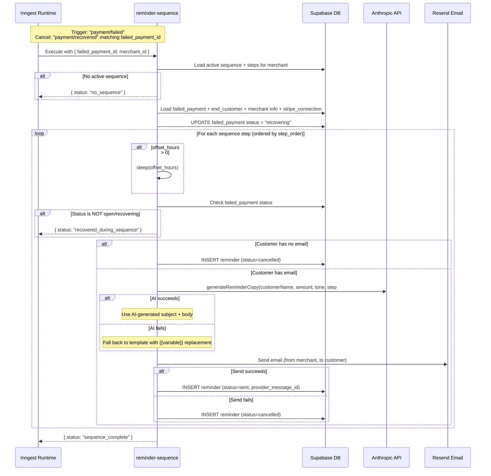

### Default Sequence Steps (provisioned at signup)

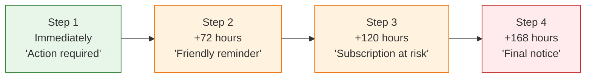

---

## 6. Dashboard Data Flow

All dashboard pages follow the same pattern: the middleware ensures the user is authenticated, then server components load the merchant record scoped to the authenticated user and query data scoped to that merchant.

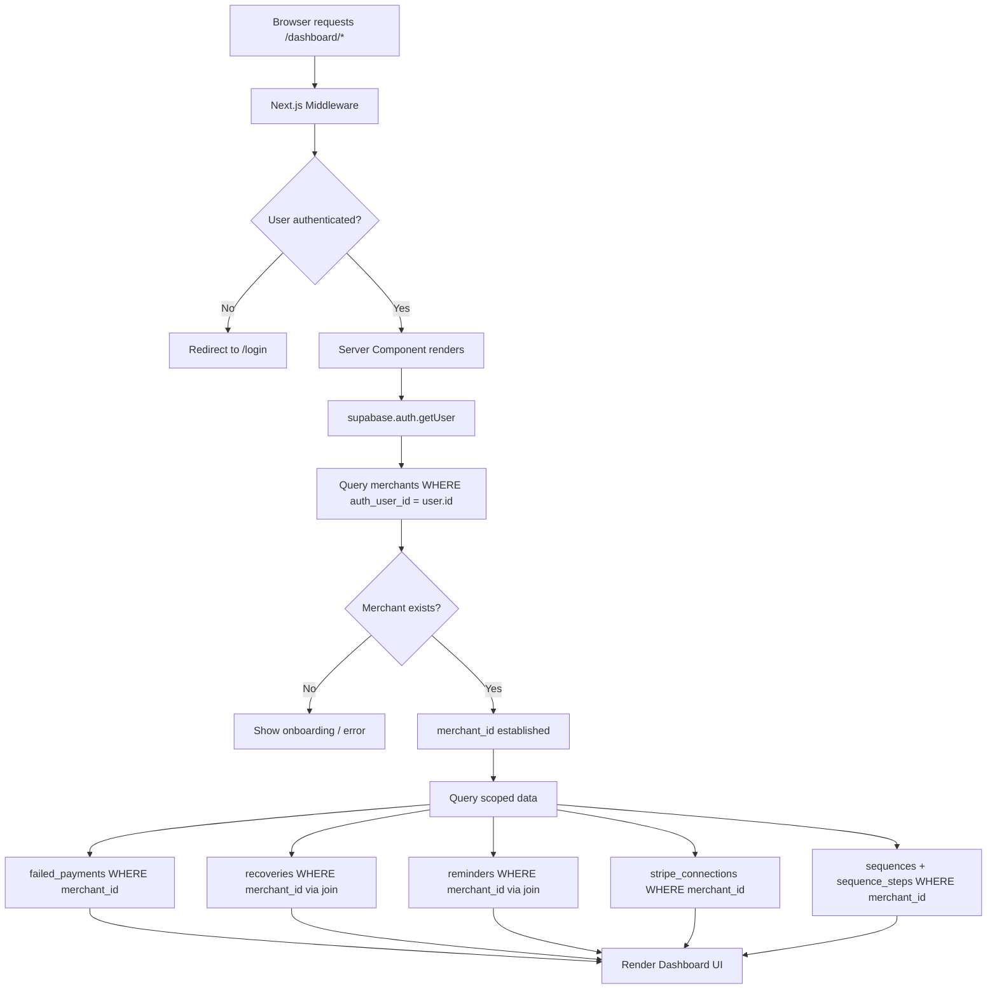

### Data Scoping Model

Every query is scoped by `merchant_id`, which is derived from the authenticated user's `auth_user_id`. This ensures strict tenant isolation -- a merchant can only see their own failed payments, recoveries, and configuration.

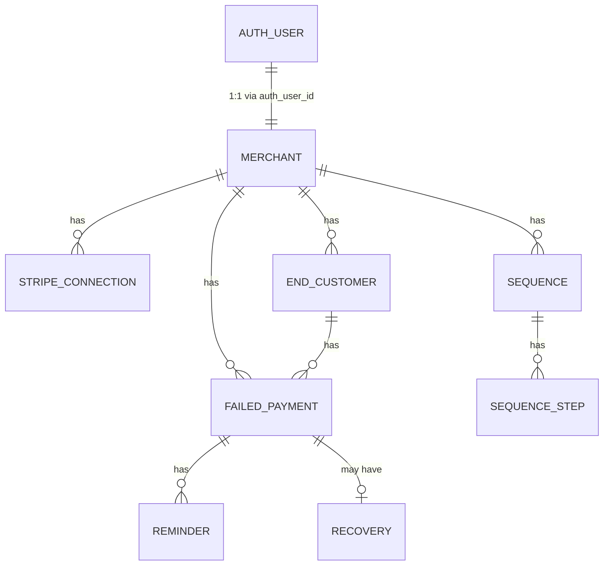

---

## End-to-End: Payment Failure to Recovery

This diagram shows the complete lifecycle from a payment failing in Stripe to a successful recovery.

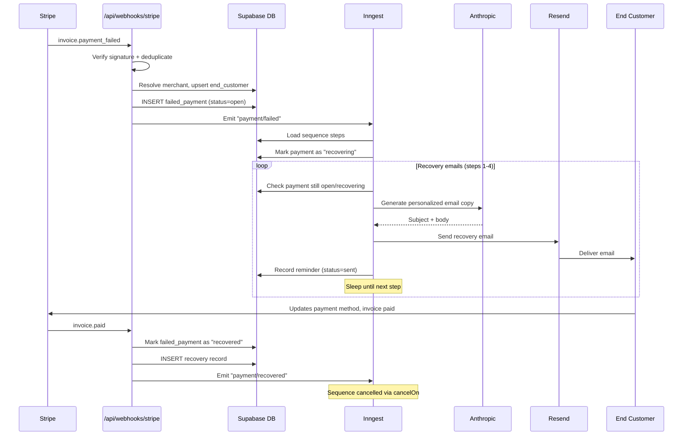
